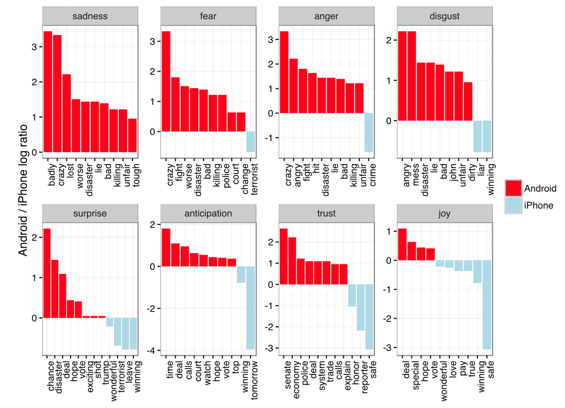
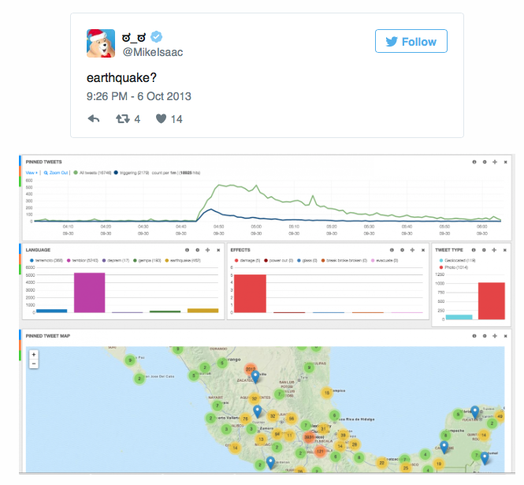
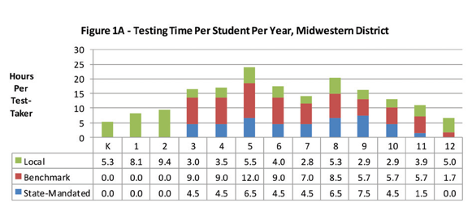
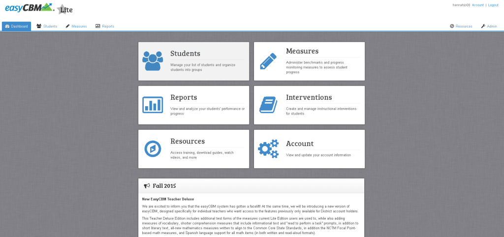
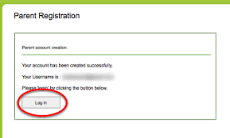
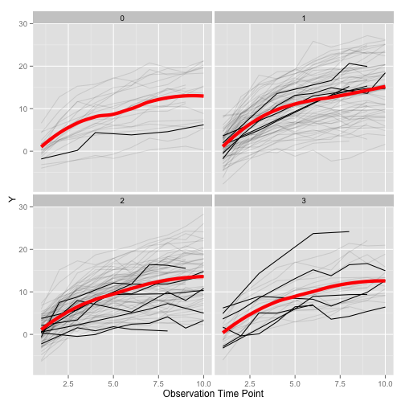

## Examples


---


---
<div align = "center">

</div>


---
<div align = "center">

</div>


---


---
## USGS: Earthquake detection


---


https://blog.twitter.com/2015/usgs-twitter-data-earthquake-detection

---
## In Education






--- &twocol

*** =left


*** =right





--- &twocol
*** =left


*** =right

<div align = "center">

</div>


---
## Discussion 

* How does this effect teaching?

> * Are data outside of education relevant? (e.g., twitter, facebook)
> * How can we harness the data to help improve education? (think broadly and "outside the box")

---
## Steps in utilizing data

> 1. Identify a question/problem
> 2. Gather the data 
 	* Collect, if necessary 
 	* Often extant data can get you close, if not exactly what you need
> 3. Analyze the data
	* Does not need to be complicated
	* Visual analysis can often be incredibly powerful and revealing
	* Linear regression (which we won't talk about much) is a very simple technique that can often be competitive with more advanced methods
	* Complexity of the question and the data often drive the complexity of the analysis
> 4. Make an inference and form a conclusion
	* Understand you're estimating (temper claims)
	* Not all data are created equal - garbage in garbage out

----
## Data basics
# Observations, Variables, Values, and Observational Units 

Generally, the following should hold:
>* Observation
	* Each row of the dataset represents an observation
>* Variables
	* Each column of the dataset represents a variable
>* Values
	* Each cell of the dataset represents a value (intersection between an observation and a variable).
>* Observational Units
	* Where are the observations collected from? Students? Schools? Parents? Administrators? etc.
	* Generally a *level* of the unit will repeat for multiple observations, unless the number of observations = number of levels within the unit (e.g., one observation per student).

---
## Caution
These terms are not universal, but are a good way to *think* about data. 

--- .quote .segue
<q> "It is often said that 80% of data analysis is spent on the process of cleaning and preparing the data"

<br>

Hadley Wickham

--- &twocol
## Data structuring: Making data usable

*** =left

* Persistent and varied challenge
* Little research on how to do it well
	+ Enter Hadley Wickham

*** =right

<div align = "center">

</div>


----
## Common ways datasets are "messy"

* Column headers are values, not variable names
* Multiple variables stored in one column
* Variables are stored in both rows and columns


----
## An example with SEDA data

Any ideas why this is messy? 

```{r seda_messy1}
library(tidyverse)
messy <- read_csv("../../data/district means national-referenced by year grade subject (long file).csv")
kable(head(messy), digits = 2)

```

----
## The offending columns

<br>

```{r seda_messy2}
kable(head(messy[ ,7:10]), digits = 2)
```
<br> 

Problem? The column headers are values, not variables. 

----
## Tidied version

```{r seda_tidy}
tidied <- messy %>% 
  gather(mean_link_ela:se_link_math, 
    key = "key",
    value = "Score") %>% 
  separate(key, c("Variable", "Discard", "Subject"), sep = "_") %>% 
  spread(Variable, Score) %>% 
  select(-Discard)

kable(head(tidied))
```

----
## Other examples
(from the JSS paper)

```{r religion_no_show}
#### Note: Code below is Hadley's 
####   (see https://github.com/hadley/tidy-data/blob/master/data/pew.r)
library(stringr)
pew <- foreign::read.spss("./assets/data/pew.sav")
pew <- as.data.frame(pew)

religion <- pew[c("q16", "reltrad", "income")]
religion$reltrad <- as.character(religion$reltrad)
religion$reltrad <- str_replace(religion$reltrad, " Churches", "")
religion$reltrad <- str_replace(religion$reltrad, " Protestant", " Prot")
religion$reltrad[religion$q16 == " Atheist (do not believe in God) "] <- "Atheist"
religion$reltrad[religion$q16 == " Agnostic (not sure if there is a God) "] <- "Agnostic"
religion$reltrad <- str_trim(religion$reltrad)
religion$reltrad <- str_replace_all(religion$reltrad, " \\(.*?\\)", "")

religion$income <- c("Less than $10,000" = "<$10k", 
  "10 to under $20,000" = "$10-20k", 
  "20 to under $30,000" = "$20-30k", 
  "30 to under $40,000" = "$30-40k", 
  "40 to under $50,000" = "$40-50k", 
  "50 to under $75,000" = "$50-75k",
  "75 to under $100,000" = "$75-100k", 
  "100 to under $150,000" = "$100-150k", 
  "$150,000 or more" = ">150k", 
  "Don't know/Refused (VOL)" = "Don't know/refused")[religion$income]

religion$income <- factor(religion$income, levels = c("<$10k", "$10-20k", "$20-30k", "$30-40k", "$40-50k", "$50-75k", 
  "$75-100k", "$100-150k", ">150k", "Don't know/refused"))
counts <- plyr::count(religion, c("reltrad", "income"))
names(counts)[1] <- "religion"

raw <- reshape2::dcast(counts, religion ~ income)
kable(raw)
```

----
## The tidied version

```{r tidy_religion}
kable(counts[1:12, ])
```

----
## Yet another example

```{r countries, results = "asis"}
## Hadley's code, again
raw <- read_csv("./assets/data/tb.csv")
raw$new_sp <- NULL
raw <- subset(raw, year == 2000)
names(raw)[1] <- "country"

names(raw) <- str_replace(names(raw), "new_sp_", "")
raw$m04 <- NULL
raw$m514 <- NULL
raw$f04 <- NULL
raw$f514 <- NULL
###

country_raw <- kable(raw[1:10, c(1:7, 10:15)])
cat(gsub('\\bNA\\b', '  ', country_raw), sep='\n')
```

In this example, *M* indicates if the data came from a male, while *F* indicates female. The subsequent numbers represent the age range. Tidying these data will be a two step process.

----
## Step one

```{r step_one}
partial <- raw %>%
  select(-mu, -fu) %>%  
  gather(variable, cases, -country:-year) 
kable(partial[1:10, ])
```
Notice this is much closer to what we want, but we have a problem now in that we have **two variables stored in one column**.

----
## Step two: Tidied data

```{r step_two}
tidied2 <- partial %>% 
  separate(variable, c("sex", "age_range"), 1) %>% 
  mutate(age_range = recode(age_range, 
                    "014" = "0-14", "1524" = "15-24", "2534" = "25-34",
                    "3544" = "35-44", "4554" = "45-54", "5564" = "55-64",
                    "65" = "65+")) %>% 
  arrange(country) %>% 
  na.omit()
kable(tidied2[1:10, ])
```

----
## Variables as rows and columns

```{r weather_raw, results = "asis"}
##### code written by Hadley
options(stringsAsFactors = FALSE)
source("./assets/data/read-fwf.r")

# Define format for fixed width file
cols <- data.frame(
  name =  c("id", "year", "month", "element"),
  start = c(1,     12,    16,      18),
  end =   c(11,    15,    17,      21))

names <- str_c(c("value", "mflag", "qflag", "sflag"), rep(1:31, each = 4), sep = "_")
starts <- cumsum(c(22, rep(c(5, 1, 1, 1), 31)))
starts <- starts[-length(starts)]
ends <- c(starts[-1], starts[length(starts)] + 1) - 1

values <- data.frame(name = names, start = starts, end = ends)
cols <- rbind(cols, values)

# Load data and subset to small example
raw <- read.fwf2("./assets/data/weather.txt",  cols)
raw <- subset(raw, year == 2010 & element %in% c("TMIN", "TMAX")) 
raw <- raw[, c(1:4, which(str_detect(names(raw), "value")))]
raw$id <- str_c(str_sub(raw$id, 1, 2), 
              str_sub(raw$id, -5, -1))

names(raw)[-(1:4)] <- str_c("d", 1:31)
raw[raw == -9999] <- NA
raw[-(1:4)] <- raw[-(1:4)] / 10 
rownames(raw) <- NULL
raw$element <- tolower(raw$element)
####

weather_raw <- kable(raw[1:10, 1:12])
cat(gsub('\\bNA\\b', '  ', weather_raw), sep='\n')
```

---- &twocol
## Two Steps

```{r tidied_weather}
molten_weather <- raw %>% 
  as_data_frame() %>% 
  gather(day_key, value, d1:d31) %>% 
  na.omit() %>% 
  arrange(id, year, month)

tidied_weather <- raw %>% 
  as_data_frame() %>% 
  gather(day_key, value, d1:d31) %>% 
  spread(element, value) %>% 
  separate(day_key, c("discard", "day"), 1, convert = TRUE) %>% 
  mutate(month = str_pad(month, 2, "left", 0),
         day = str_pad(month, 2, "left", 0)) %>% 
  unite(date, year, month, day, sep = "-") %>% 
  select(-discard) %>% 
  arrange(id, date) %>% 
  na.omit()
```

*** =left
# Step 1
```{r print_molten_weather}
kable(molten_weather[1:10, ])
```

*** =right
# Step 2
```{r print_tidied_weather}
kable(tidied_weather[1:10, ])
```

----
## A caveat
* There are many reasons why you might want to have messy data. However, tidy data is an extremely useful format. 

--- &twocol
## Let's look at our simulated class data

*** =left

<div align = "left">

</div>

# Discuss the following with a partner or in groups of 3
* Are these data tidy?
* If not, describe what needs to happen to make them tidy.

*** =right

<div align = "right">

</div>

---
## Tidied version

```{r tidy_sim_data}
d <- read_csv("../../data/sim_data_EBDM.csv")
sum <- rowSums(d[ ,4:14])
d$none <- ifelse(sum == 0, 1, 0)

disab <- d %>% 
	select(1:14, 28) %>% 
	gather(disability, indicator, -1:-3) %>% 
	filter(indicator == 1) %>% 
	select(-5)

eth <- d %>% 
	select(1:3, 15:20) %>% 
	gather(ethnicity, indicator, -1:-3) %>% 
	filter(indicator == 1) %>% 
	select(-5)
scores <- d %>% 
	select(1:3, 25:27) %>% 
	gather(grade, score, -1:-3) %>% 
	mutate(grade = parse_number(grade))

d2 <- left_join(disab, eth)
d2 <- left_join(d2, scores)
d2 <- left_join(d2, d[ ,c(1:3, 21:24)])
d2 <- d2 %>% 
	arrange(sid, grade) %>% 
	select(1:3, 8:11, 4:7)
kable(head(d2))
```

----
## Let's explore these data a bit.
# By disability
```{r by_disab, fig.width = 10}
theme_set(theme_bw())
ggplot(d2) +
	geom_violin(aes(factor(grade), score)) +
	geom_smooth(aes(I(grade - 5), score), method = "lm") + 
	facet_wrap(~disability)
```

----
# By disability (continued)

```{r by_disab_slopes, fig.width = 10}
means_disab <- d2 %>% 
	group_by(grade, disability) %>% 
	summarize(score = mean(score))

library(RColorBrewer)
ggplot(means_disab, aes(grade, score, color = disability)) + 
	geom_point(cex = 3) +
	geom_line(lwd = 2) + 
	scale_color_brewer(palette = "Set3") 
```

----
# By Ethnicity

```{r by_ethnicity, fig.width = 10}
means_eth <- d2 %>% 
	group_by(grade, ethnicity) %>% 
	summarize(score = mean(score))

ggplot(means_eth, aes(grade, score, color = ethnicity)) + 
	geom_point(cex = 3) +
	geom_line(lwd = 2) + 
	scale_color_brewer(palette = "Set3") 
```

--- 
## Things we haven't covered

* Data types
* Samples and populations (and sampling methods)
* Outcome versus predictor variables
* Observational versus experimental analysis

---
## What's next

* Data types and distributions
* Intro to data visualization: We'll focus on exploratory plotting
* Applied data visualization: You get to try!

# For the last class

* Get R installed: https://cran.r-project.org
* Get RStudio installed: https://www.rstudio.com/products/rstudio/download/

**NOTE:** If you need help with either of the above, please contact me. I'd like everybody to be ready to go **before** we need to use it. Best to get it installed now and make sure it's working so we can troubleshoot if not.

